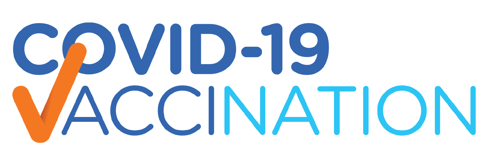

<div align="center">



</div>

## Cloning the repository

--> Clone the repository using the command below :

```bash
git clone https://github.com/daviddsapir/CovidVaccination.git

```

--> Move into the directory where we have the project files :

```bash
cd CovidVaccination
```

#

## Create a virtual environment

```bash
# Let's install virtualenv first
pip install virtualenv

# Then we create our virtual environment
virtualenv env
```

#

## Build React Project

```bash
# cd to react project folder
cd ./front_end

# Run npm install to install and dependence's
npm install

# Run npm run build to build the project
npm run build

# go back to project folder
cd ../
```

#

## Activate the virtual environment

### MacOS

```bash
. ./env/bin/activate
```

> ⚠ On MacOS we need the "." before the command to specify where we want the virtual environment to work. "." means the current directory.

### windows

```bash
.\env\scripts\activate
```

#

## Install Django

After complete creating the directory and virtual environment, it’s time to install Django

```bash
# Let's install django first
pip install django
```

#

## Setting up the database server

<ul>
    <li>Open pgAdmin4</li>
    <li>Click server, and choose PostgreSQL version, in this article, I use version 14</li>
    <li>Then create our database: name the database: <b>CovidVaccinationDB</b></li>
</ul>

#

## Migrate the table to PostgreSQL database

### MacOS

```bash
pip install psycopg2-binary

python manage.py makemigrations

python manage.py migrate
```

### windows

```bash
pip install psycopg2

python manage.py makemigrations

python manage.py migrate
```

#

## Running the App

### To run the App, we use :

```bash
python manage.py runserver
```

> ⚠ Then, the development server will be started at http://127.0.0.1:8000/

#
